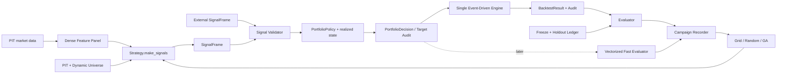

# Cross-Sectional Strategy Research Architecture Spec

> 狀態：**DRAFT v3.1 — event-first 與 v1.1 policy 已授權；下一步收斂為單次 holdout，進階研究層延後**
> 日期：2026-08-16
> 適用 repo：`tw-swing-factor`
> 目的：先固定研究語意、資料契約與實作順序，再逐階段開發；避免把架構搬遷、策略改良與參數最佳化混在同一次變更中。

---

## 0. 決策摘要

本規格把後續工作拆成兩條主線，但要求它們共用同一組資料與驗證契約：

1. **策略與進出場主線**
   - Python `make_signals()` 產生可稽核的 cross-sectional 訊號。
   - 已有的 `StrategyPositionPolicy` 把訊號轉成目標持倉，明確定義買進、續抱、
     換股、賣出與權重；本輪只修正累積災難損失上限與停損後 re-arm 語意。
   - 唯一的事件驅動引擎把目標持倉轉成可成交訂單，處理 T+1、漲跌停、處置、停牌、成本與股數。

2. **研究與搜尋主線**
   - Typed `ParameterSpace` 描述可搜尋參數，不把任意 Python 原始碼直接交給 GA 變異。
   - **第一階段 event-first**：先證明外部 `make_signals()` 能經參數契約、進出場 policy 與唯一事件引擎完整跑通。
   - **下一階段 single-holdout**：只做一組固定 IS／embargo／locked OS；研究程序只載入 IS，規則凍結且 owner 明確授權後才揭露 OS 一次。
   - **更後面才新增 vectorized fast evaluator**：以已經通過的事件引擎結果當 golden oracle，用 IC、分位組合、近似 turnover 與 research-only PnL 加速大量候選篩選。
   - Campaign 以 append-only manifest、candidate hash、generation ledger 保存每一次輸入、輸出、失敗與淘汰理由。
   - 先證明 grid/random search 能正確重現，再加入 parameter GA；結構型 GA 延後。

最重要的優先順序不是先做 GA，而是：

```text
研究正確性閘門
→ 外部 make_signals／參數／訊號契約
→ 現行進出場與唯一事件引擎端到端 parity
→ StrategyPositionPolicy v1.1 契約與事件引擎整合
→ 單次 IS／embargo／locked OS 資料閘門
→ event-only 評估、研究紀錄與小型 grid/random
→ vectorized fast evaluator
→ parameter GA
→ structural search
→ 多策略組合
```

如果前四層沒有先固定，GA 只會更有效率地找到資料漏洞、執行漏洞或偶然的最佳參數。

---

## 1. 背景與目前問題

### 1.1 目前已經具備的能力

本 repo 已有下列可重用基礎：

- long panel 資料結構：每列是一個 `(date, stock_id)`。
- PIT 月頻候選池與每日 dynamic universe。
- 稠密 panel 的時間序列因子計算路徑。
- `factor_engine/operators.py` 的因果 primitive operators。
- the legacy strategy line 的 Python `build_signal()`、`build_picks()`、全相位評估原型。
- `picks_by_date` 到唯一事件驅動 `backtest_portfolio()` 的橋接。
- T+1 開盤、漲跌停、處置、成本、股數、停牌／下市與價格完整性閘門。
- IS／embargo／OS、freeze／forward 與規則 hash 的初步機制。

### 1.2 目前不足之處

1. `picks_by_date` 主要表達「今天可以買誰」，不能完整表達：
   - 目前持股是否應續抱。
   - 哪一檔應被哪一檔替換。
   - 目標權重是多少。
   - 賣出原因與決策時間。

2. legacy the legacy strategy line 主要由 MA、硬停損與最長持有期退出；新的 policy 路徑已有 top-10
   進場／top-20 續抱與每週排名退出，但尚未被一個正式 Python-first runner 從
   `make_signals()` 端到端呼叫。

3. `StrategySpec` 目前只夠凍結 the legacy strategy line 的少量參數，尚不是通用的 cross-sectional strategy contract。

4. Python 策略雖然有彈性，但尚未正式約束：
   - 必要欄位與 warmup。
   - 可使用的 universe 與 as-of 語意。
   - 輸出 schema。
   - deterministic seed。
   - 是否允許網路、檔案副作用與全域 config mutation。

5. 尚無正式的 `ParameterSpace`、candidate identity、campaign recorder、fast evaluator、GA runner 與 strategy portfolio admission。

6. 架構搬遷、策略語意修正與參數最佳化若同時發生，無法判斷績效變動來自哪一層。

7. 現行 the legacy strategy line 雖可把 `StrategySpec` 傳入訊號函式，但部分投組／出場參數仍靠執行期間暫時改寫全域 `config` 傳給引擎；這在平行搜尋時會產生 candidate 之間的參數污染。

---

## 2. 目標與非目標

### 2.1 目標

- 讓研究者或 AI 可以用普通 Python 寫 `make_signals()`，不被 YAML operator 清單綁死。
- 保留 operators 作為已審計 primitive，而不是把它變成唯一能表達策略的方法。
- 同一個策略同時支援：單次回測、參數搜尋、GA、freeze、forward 與日後的人工候選輸出。
- 讓每一個 candidate 都能回答：用了什麼資料、程式碼、參數、universe、切割、phase、成本與退出規則。
- 讓進出場規則可組合、可凍結、可驗證，但不把所有策略強迫成同一種退出邏輯。
- 讓快速研究層和正式事件引擎共享同一個訊號契約，避免兩套策略語意。
- 同時支援 repo 內註冊的 Python `make_signals()` 與帶完整 provenance 的外部序列化 `SignalFrame`，但兩者都必須通過同一 validator。
- 保留失敗 candidate 與淘汰原因，避免 AI 重複探索已證偽區域。

本規格的寬嚴原則是：**策略表達要寬，證據邊界要嚴**。研究者與 AI 可以自由撰寫新的因子交互與訊號邏輯；PIT、as-of、評估窗、成交規則、provenance 與 holdout 不能因為方便而放寬。

### 2.2 非目標

- 本階段不建立自動下單或券商串接。
- 本階段不讓 AI 自由生成任意 Python 後直接進 clean OOS。
- 本階段不把 YAML 當完整程式語言。
- 本階段不建立第二套正式回測引擎。
- 本階段不宣稱任何 the legacy strategy line 或新策略有效。
- 本階段不把 GA 找到的最佳 candidate 自動升級成 production／forward 策略。
- 本階段不一次完成新聞／財報 AI 分析層。

---

## 3. 不可破壞的研究不變式

以下條件優先於所有 API 便利性與搜尋速度。

### 3.1 時間序列與橫斷面必須使用不同母體語意

正確順序不是單純一句「全部先算完再過濾」，而是：

```text
稠密個股歷史
→ 計算 ts_* / rolling features
→ 套用當日 PIT candidate + dynamic universe eligibility
→ 只在當日 eligible 股票內計算 cs_* / rank / z-score
→ 組合 raw alpha score
→ 形成 entry / hold / exit 狀態
```

- `ts_*` 必須看到該股連續交易日，不得只看到間歇的 universe 成員列。
- `cs_*` 的排名母體必須是**當日 PIT 可知的顯式集合**，而且必須是策略的可凍結參數
  （`ranking_universe`）。合法值只有兩個：當月 PIT candidate pool（`pool`，預設）
  與當日 eligible universe（`eligible`）。
- **排名母體不得是「panel 剛好有哪些列」。** 稠密 panel 為了 `ts_` 保留全部列，
  而正式 panel 是所有月份候選池的**聯集**（實測 753 檔、每日 722 檔有 bar），
  它不是任何一天真實存在的橫斷面：一檔數月後才進池的股票會影響今天的名次，
  而且母體會隨快照與回測區間漂移。因此 `panel` 母體只可作對照組，
  其產出必須標記不可作正式證據。
- 可買集合必須是排名母體的**子集**。否則可買股票會拿到 NaN 分數而被靜默排除，
  輸出看起來只是「那天入選的比較少」。這一點必須 fail-closed。
- 選擇 `pool` 的理由是保留「相對於整個流動性池有多強」的水準資訊，再從中挑當日
  可買者；選擇 `eligible` 的理由是讓權重相對於實際選擇集合有意義。兩者都合規，
  但**必須顯式宣告並凍結**，因為兩者會選出不同的股票（實測 top10 在 46.5%～59.7%
  的日子不同）。
- 所有 SignalFrame 必須記錄 `eligibility_rule_id`、`ranking_universe_count`
  （rank 的母體＝當日輸出列數）與 `score_universe` / `score_universe_count`
  （`cs_*` 的母體與其大小）。這兩組是不同的東西，不可互相替代。

### 3.2 所有決策必須有 as-of 與最早可成交時間

- T 日收盤資料產生的訊號，最早只能在 T+1 開盤成交。
- 需要 T 日 high／low 才知道的規則，不能宣稱在 T 日 high／low 之前成交。
- 財報、公告、新聞若日後進入策略，必須使用公開時間而非報表所屬日期。

### 3.3 正式歷史策略只能使用 PIT universe

- `SignalContext` 必須帶 `universe_provider_id`、candidate rule 與 pool as-of。
- static current top-N 只可作 comparator，產出必須標記不可作正式證據。

### 3.4 唯一正式績效來源是事件驅動引擎

- fast evaluator 可算 IC、rank spread、理想權重 turnover，但不得宣稱正式投組 Sharpe。
- 所有可升級證據等級的績效必須經唯一事件引擎。
- 不得在 strategy plugin 內自己維護 cash／positions／MTM。

### 3.5 研究結果不可只靠「測試通過」升級

- schema、單元測試與 parity 只證明程式行為，不證明 alpha。
- 任何策略升級仍需 benchmark、所有相位、成本、凍結規則與 untouched OS／forward。
- rolling／walk-forward 是日後增加穩健性的工具，不是 V1 單次 holdout 的前置條件；
  未做 rolling 時必須明示統計檢定力與 regime 覆蓋有限。

---

## 4. 建議總體架構



### 4.1 責任邊界

| 模組 | 負責 | 不負責 |
|---|---|---|
| Data／Universe | PIT 資料、稠密歷史、當日 eligibility | 策略排名與交易 |
| Strategy | features 到 alpha／thesis 狀態 | 現金、成交、股數 |
| PortfolioPolicy | entry／hold／exit、目標權重、換股 | 模擬成交價格 |
| Event Engine | 將目標狀態轉成可成交訂單 | 發明策略訊號 |
| Evaluator | 指標、切割、相位與淘汰判定 | 改寫 candidate |
| Search | 產生參數 candidate | 偷看 locked OS |
| Campaign | lineage、artifact、失敗紀錄 | 挑選最好看的報告 |

`Vectorized Fast Evaluator` 是後續研究加速層，不是第二套正式引擎。它必須在 event-only 端到端路徑有 golden cases 之後才實作，並持續計算 fast-versus-event fidelity gap。

---

## 5. Python-first Strategy Contract

### 5.1 原則

Python plugin 是第一級策略表達方式；YAML／JSON 只承載：

- 策略註冊名。
- 參數值。
- 資料需求。
- portfolio policy。
- evaluator 設定。
- lineage 與 artifact manifest。

不要求把每個研究想法翻譯成 YAML operator tree，也不允許 manifest 指定任意 import path。

### 5.2 建議介面

```python
class CrossSectionalStrategy(Protocol):
    name: str
    version: str

    def data_requirements(self) -> DataRequirements: ...
    def parameter_space(self) -> ParameterSpace: ...
    def default_parameters(self) -> dict: ...

    def make_signals(
        self,
        panel: pd.DataFrame,
        params: Mapping[str, Any],
        context: SignalContext,
    ) -> SignalFrame: ...
```

`make_signals()` 只負責產生訊號，不自己管理部位、不呼叫回測、不回傳 Sharpe。評分由 evaluator 對完整 `SignalFrame → PortfolioPolicy → Event Engine` 結果產生，避免外部策略自己挑選評分方式。

### 5.3 DataRequirements

至少包含：

- `required_columns`
- `optional_columns`
- `warmup_bars`
- `price_adjustment_requirement`
- `requires_industry`
- `industry_pit_required`
- `minimum_cross_section`
- `maximum_data_lag`
- `external_dataset_ids`

缺欄位、warmup 不足或資料時效不符時必須 fail-closed 或輸出明確 `not_eligible_reason`，不得用 0、空值或 all-False 靜默替代策略結果。

### 5.4 SignalContext

必須包含：

- `as_of`
- `evaluation_window`
- `universe_provider_id`
- `eligibility_mask`
- `ranking_mask`
- `phase`
- `rng_seed`
- `campaign_id`
- `candidate_id`
- `mode = discovery | validation | forward | live`

### 5.5 Plugin 安全限制

- plugin 必須從 repo 內的策略 registry 解析，不接受 JSON 直接傳任意 Python path。
- `make_signals()` 不得打網路、寫 output、改 `config` 或讀取未宣告檔案。
- 同一 panel、params、context、seed 必須產生相同輸出。
- plugin 的 Git blob／commit fingerprint 必須進 candidate identity。
- 研究時可新增自訂 Python 邏輯，但要補因果性、對齊、未來擾動與輸出 schema 測試。

### 5.6 外部 Signal Provider

為了讓其他 repo、AI 研究過程或預先計算的訊號可進入本引擎，系統應支援序列化 `SignalFrame` 輸入。必要 metadata 至少包含：

- `strategy_id` / `strategy_version` / `strategy_rule_hash`
- `generated_at`、`data_snapshot_id`、`universe_provider_id`
- `signal_start`、`signal_end`、`earliest_execution_rule`
- `parameter_values`、`code_fingerprint`、`producer`
- frame schema version 與 completeness 狀態

外部 frame 不因為已經算好就被信任；validator 仍要檢查 key 唯一、日期邊界、當日 ranking universe、缺列語意、as-of 與未來擾動。缺乏上述 provenance 的 frame 可供除錯，但不能產生 formal-evidence-eligible 結果。

### 5.7 CandidateSpec 與 BacktestRequest

搜尋參數與評估協議必須分離：

```text
CandidateSpec
├─ strategy_id / version / code fingerprint
├─ signal_params
├─ portfolio_params
└─ exit_params

EvaluationProtocol
├─ data snapshot / PIT universe / split boundaries
├─ benchmark / phases / costs / fill model
├─ seed / evaluator version
└─ research evidence mode

BacktestRequest = CandidateSpec + EvaluationProtocol
```

- GA 與 grid/random 只能變動 `CandidateSpec` 中 ParameterSpace 允許的值。
- `EvaluationProtocol` 在一個 campaign 內固定，不得成為 genome。
- 引擎應使用 immutable request，不得靠暫時改寫全域 `config` 傳遞 candidate 參數。
- 過渡期可由 adapter 把 request 映射到現行引擎，但必須單執行緒、try/finally 還原並標記 `legacy_config_adapter=True`；此路徑不可用於平行 GA。

---

## 6. SignalFrame 契約

### 6.1 必要欄位

| 欄位 | 語意 |
|---|---|
| `date` | 訊號 as-of 交易日 |
| `stock_id` | 標的 |
| `eligible` | 當日是否可被選 |
| `raw_score` | 未做當日 rank 的策略原始分數 |
| `alpha_score` | 策略組合後分數；不可假設已校準成預期報酬 |
| `rank` | 當日 eligible universe 內名次，1 最佳 |
| `rank_pct` | 當日 eligible universe 內百分位 |
| `thesis_ok` | 原買進邏輯是否仍成立 |
| `hard_exit` | 資料／策略明確要求退出；不等於已成交 |
| `reason_codes` | 可機器解析的理由代碼 |
| `ranking_universe_count` | 當日 **rank** 的母體數量＝當日輸出列數（`rank` ∈ 1..N） |
| `score_universe` | `cs_*` 算子的排名母體名稱（`pool` / `eligible` / `panel`） |
| `score_universe_count` | 當日 `cs_*` 母體的檔數；與 `ranking_universe_count` 不同 |

> ⚠ `score_universe*` 目前的**強制點在 `strategy_kit/signal_builder.py`**（H 系列一定
> 會帶），尚未加進 `research/signal_validation.REQUIRED_COLUMNS`。原因是 legacy 橋接
> 用的 `strategies/h3_short_reversal.py` 還沒帶這兩欄，現在就強制會讓它 fail-closed。
> **待 `h3_short_reversal` 退場或補齊後，這兩欄要升為 validator 的必要欄位**；在那之前，
> 「外部序列化 SignalFrame」這條路徑仍可能缺少排名母體的紀錄。

### 6.2 選用欄位

- `factor_contributions`
- `uncertainty`
- `expected_horizon`
- `capacity_bucket`
- `group_id`
- `signal_family`

### 6.3 重要限制

- `raw_score` 必須保留；只留 0～1 rank 會失去訊號幅度與跨日診斷能力。
- `rank_pct` 只能在同一天、同一 ranking universe 比較，不得當成跨日可直接比較的預期報酬。
- factor contribution 只作稽核，不應要求所有自訂 Python 策略都能被 operators 完全分解。

---

## 7. 進場、續抱、賣出與目標持倉

### 7.1 為什麼不能只用 picks_by_date

完整的 cross-sectional 投組需要表達「想持有什麼」，而不只是「今天誰排名最高」。建議新增 `PortfolioDecision`，並將每日決策序列化成 `TargetPortfolioFrame` 作為稽核產物：

| 欄位 | 語意 |
|---|---|
| `date` | T 日收盤後形成的目標 |
| `stock_id` | 標的 |
| `target_weight` | 希望持有的權重，0 表示希望退出 |
| `action` | `enter / hold / resize / exit` |
| `reason_code` | `new_top_k / rank_decay / thesis_break / risk_stop / ...` |
| `decision_score` | 當下分數，不能沿用買進日舊分數 |
| `decision_rank` | 當下排名 |
| `earliest_execution` | 通常為 T+1 open |

事件引擎另行記錄 desired target 與 realized holdings 的差異；漲跌停或停牌造成無法成交時，不得假設目標已達成。

`TargetPortfolioFrame` **不假設必須在回測前一次預計算完整段落**。rank buffer 可以根據上一期 desired state 預先計算；但 hard stop、實際持有日數、賣不掉後的換股與現金受實際成交影響，`PortfolioPolicy` 必須能在事件引擎中接收唯讀 `RealizedPortfolioState` 後逐日產生決策。Target frame 是 policy 決策的完整紀錄，不是繞過事件引擎的另一份部位真相。

每個 target snapshot 必須另外帶：

- `snapshot_complete=True`：代表該日列出的股票是完整目標集合，現有持股若不在集合內才可解讀為 target 0。
- `target_cash_weight`：允許策略在沒有足夠好候選或 risk-off 時保留現金。
- `decision_frequency` 與 `trigger_type`：區分定期 rank rebalance、每日 thesis check 與緊急風險事件。

缺少完整快照旗標時，「股票沒有出現在 frame」只能解讀為 unknown，不能自動賣出。所有 target weights 加上 cash target 應有明確的容許誤差與總和驗證。

### 7.2 ExitPolicy 分層

退出規則分成五類，優先序由上到下：

1. **資料／交易強制退出**
   - 下市清算、長期無 bar、失去合法交易資格。
   - 處置與跌停鎖不一定能立即退出；由引擎延遲成交。

2. **風險退出**
   - 固定或 volatility-adjusted hard stop。
   - 市場 risk-off 曝險下降。
   - 單檔／族群風險上限。

3. **策略 thesis-break**
   - 核心因子失效。
   - 趨勢條件破壞。
   - 必須由各策略自行宣告，不能把 MA60 強迫到所有策略。

4. **cross-sectional rank decay／機會成本換股**
   - 持股掉出 exit buffer。
   - 有更強的新候選，且改善超過 replacement gap。

5. **時間退出**
   - max holding period 作為 dead-capital／資料異常保護。
   - 不預設固定持有期一定是 alpha exit。

### 7.3 第一個推薦研究基準，不是最終參數

```text
entry_rank = 10
hold_buffer_rank = 20
rebalance_days ∈ {5, 10, 20}
replacement_gap ∈ {0, 0.03, 0.05}
rank_confirmation ∈ {1, 2}
trend_exit ∈ {off, MA20, MA60}
catastrophic_loss_cap = 20%（固定，不進第一階段搜尋）
max_hold_days = 120
```

未來若要研究 exit family，可比較四個固定版本，但不屬於本輪 golden path：

1. 現況：MA60＋15% stop＋120 日。
2. 純 rank buffer：top 10 進、掉出 top 20 出。
3. rank buffer＋replacement gap。
4. rank buffer＋strategy thesis-break＋20% cumulative catastrophic loss cap。

`hard_stop_pct` 在相容介面中暫時保留欄位名，但正式語意是「相對實際進場成本的
累積經濟損失」，不是單日跌幅。單日 -8%／跌停不自動退出；累積收盤報酬到 -20%
才產生 T+1 退出意圖，且實際成交仍受漲跌停、停牌與流動性限制。停損後必須先掉出
top 20，再重新進 top 10 才能 re-arm，避免下週立刻買回。

不要一開始把全部參數一起交給 GA；先做可歸因 A/B。

### 7.4 換股規則

建議語意：

```text
existing rank > exit_rank
AND new candidate rank <= entry_rank
AND new_score - existing_score >= replacement_gap
AND minimum_hold satisfied
→ T+1 open 嘗試賣弱買強
```

若賣出因跌停無法成交，新買進不得假設自動取得原本預計釋放的現金。

Rank 本身永遠能排出 top 10，即使所有股票的絕對訊號都很差。因此 entry 還必須通過至少一種「可不買」閘門，例如 strategy thesis、raw-score floor、market regime 或 minimum breadth；否則 top-K 會被誤解成任何環境都必須滿倉。這個 cash option 必須出現在 PortfolioSpec，而不是由執行引擎偷偷決定。

### 7.5 部位權重

第一階段正式基準使用等權，原因是 0～1 rank 並不是校準後的預期報酬。

後續可比較：

- equal weight。
- capped score weight。
- inverse-volatility weight。
- score × inverse-volatility。
- 產業／題材 cap。

所有 weighting rule 必須是 `PortfolioSpec` 的一部分並進 hash。不得讓 optimizer 默默改變權重規則後仍冒用同一個 strategy identity。

為避免很小的權重漂移造成不必要交易，日後可加入 `weight_no_trade_band`；但它要在等權 target 與 rank exit 語意穩定後再研究，不能和第一版 exit family 同時調整。

---

## 8. ParameterSpace 與 Candidate Identity

### 8.1 Typed ParameterSpace

每個參數必須宣告：

- 名稱與所屬：`signal / portfolio / exit / evaluator`。
- 型別：`int / float / categorical / bool`。
- 範圍或候選集合。
- scale：linear／log。
- mutation step 或 distribution。
- 條件依賴，例如 `atr_multiple` 只有 `stop_type=atr` 時有效。
- constraint，例如 `exit_rank > entry_rank`。

### 8.2 Rule identity 與 evaluation identity 必須分開

不得只做一個混合 hash。至少要有兩層：

**`strategy_rule_hash`**：代表「凍結的是哪一套交易規則」，包含：

- strategy registry name + version。
- strategy code fingerprint。
- normalized signal parameters。
- DataRequirements 與欄位語意版本。
- PortfolioSpec + ExitPolicy。
- universe／eligibility／ranking rule。

它不包含資料截止日、fold 或 evaluator 版本；同一套凍結規則推進資料做 forward 時，rule hash 必須保持不變。

**`evaluation_run_hash`**：代表「這套規則在哪一次實驗中如何被評估」，包含：

- `strategy_rule_hash`。
- data snapshot／dataset fingerprints。
- V1 的固定 IS／embargo／OS boundaries；日後若加入 rolling，再包含 fold definitions。
- evaluator protocol version。
- phase protocol、cost model、seed。

同參數但不同程式碼、不同 universe、不同退出規則不得共用 rule hash；同一 rule 在不同資料快照或 folds 上則有不同 evaluation run hash。Campaign 裡的 candidate 可以引用 rule hash，但每一份 metrics 必須引用 evaluation run hash。

### 8.3 禁止事項

- parameter GA 不得直接 crossover 任意 Python source。
- evaluator／fold／成本設定屬於 campaign protocol，不得作為 genome 讓 optimizer 選擇；否則 optimizer 會挑對自己最有利的評分方式。
- 無效參數不得被靜默裁切成合法值；應標 `invalid_genome` 並保留原因。
- 缺資料、無交易或 evaluator error 不得轉成漂亮的 0 分後混在正常候選中。

---

## 9. 評估管線

### 9.1 實作階段 I：event-first golden path

在新增 vectorized system 前，先用唯一事件引擎完成一條可重複的端到端路徑：

```text
CandidateSpec
→ make_signals() 或 external SignalFrame
→ SignalFrame validator
→ PortfolioPolicy / ExitPolicy
→ Event Engine
→ trades + equity + phase metrics + provenance
```

先用 the legacy strategy line 做 mechanical parity，再以一個新 strategy version 驗證 eligible-universe rank 與新進出場 policy。此階段允許只跑小型 grid/random，即使慢也可接受；目標是先證明參數真的傳到正式引擎，而不是先追求吞吐量。

2026-08-16 owner 授權的第一個 slice **不含** grid/random。repo 已提供
`strategies/h3_short_reversal.py` 作為 `make_signals()` fixture；黑箱 runner 已完成
（`research/golden_path.py`，2026-08-16），並讓
`tests/test_make_signals_golden_path_contract.py` 使用 synthetic data 仍走真 validator、
真 `StrategyPositionPolicy` 與真 event engine。這個測試只證明管線，輸出必須明示
`formal_evidence_ready=false` 與 `performance_claim=none`。

### 9.2 正式事件回測要求

- T+1 open。
- 全部等價 phase。
- PIT universe。
- 成本、稅、張數與資金。
- 漲跌停、處置、停牌／下市。
- desired vs realized portfolio audit。
- benchmark 與 excess performance。
- turnover、容量與 concentration。
- 賣出所得何時可再次投入、同日買賣淨額與交割資金假設；若尚未精確模擬，必須在 provenance 明示。

### 9.3 V1：單次固定 holdout

- 只建立一組固定 IS／embargo／locked OS，不另切 TRAIN／VALID，也不跑 rolling folds。
- 所有策略發想、調參、淘汰與比較都只能使用 IS；embargo 不計分。
- Research mode 的資料載入上限就是 `is_end`，不能先載入 OS 再只裁輸出。
- 策略與 protocol 凍結後，owner 以獨立 reveal 動作讓同一 rule hash 在 OS 上重算一次。
- IS 與 OS 仍各自跑滿全部 phase、成本與 benchmark；單一 OS 的樣本與 regime 有限，
  結論不得描述成已通過多 regime 穩健性。

完整邊界與驗收見 `research/docs/EVALUATION_DATA_BOUNDARY_SPEC.md`。多個 rolling
TRAIN／VALID folds、staged validation 與 walk-forward analysis 明確延後；若未來加入，
任何參與 selection 的 shard 都叫 VALID，不能回頭改稱 locked OS。

### 9.4 Locked OS 與 forward

- 選定少量 candidate 後 freeze。
- 第一次揭露 OS 寫 append-only holdout ledger。
- 重跑同一 OS 只能標 reproduction，不再標 fresh OOS。
- 任何看過 OS 後的變更都是新 strategy hash，重新累積 forward。

任何用於演化的資料切片在本 repo 統一命名為 `VALID`。只要它參與 selection、fitness、mutation schedule 或是否保留 candidate，就已被消耗，不是 locked OS。

### 9.5 實作階段 II：vectorized fast evaluators

只在 event-first golden path 穩定後新增：

**Fast A0 訊號層**：

- daily cross-sectional IC／Rank IC、ICIR、rolling stability。
- top-bottom quantile spread、coverage、missingness、effective universe size。
- signal autocorrelation／half-life、rank persistence、candidate correlation。
- future-data perturbation check。

**Fast A1 近似投組層**：

- 共用同一 PortfolioPolicy 產生理想 target。
- 使用 T+1 報酬、理想權重、近似 turnover 與簡化成本。
- 輸出只能命名為 `approx_*` 或 `research_only_*`，不得與正式 event metrics 共用欄位名。
- 不假裝模擬漲跌停鎖、處置、整張、資金不足、停牌或實際 fill state。

每個正式評估過的 candidate 都記錄 `fast_event_fidelity_gap`。若某個 family 系統性在 fast 表現優異但 event 失效，search policy 應降低它的快速分數信任度或提高抽樣進 event 的比例。

---

## 10. Fitness 與 GA 設計

### 10.1 不先把所有東西壓成單一分數

每個 candidate 先保存 metric vector：

- excess Sharpe median／minimum。
- MaxDD。
- turnover 與成本占 gross alpha 比率。
- IS 內參數鄰域／子期間穩定性（若有預先登記）。
- IC／ICIR。
- n_trades、coverage。
- phase dispersion；單次 OS 指標只供凍結後報告，不得回流 fitness。
- concentration、單一股票貢獻。
- signal correlation 與 holdings overlap。

先用 hard constraints 淘汰：

- integrity bypass。
- 非 PIT。
- eval window overflow。
- 交易數／coverage 不足。
- 只有少數 phase 成立。
- benchmark 缺失。
- 未來擾動改變過去訊號。

之後才可使用預先登記的 scalar fitness 或 Pareto ranking。不能每一輪看到結果再調 fitness 權重。

### 10.2 搜尋順序

1. 手寫固定 baseline。
2. **event-only 小型 grid search**，證明參數傳遞、進出場、artifact 與結果可重現。
3. event-only seeded random smoke，驗證 campaign 中斷／恢復與失敗保留。
4. 以 event golden cases 建立 vectorized Fast A0／A1。
5. 使用 fast 大量篩選，top／diverse sample 送 event；與等預算 seeded random 建立基準。
6. parameter GA：只變異 typed parameters。
7. conditional parameter GA。
8. structural search：只在明確 grammar／strategy family 內組合，延後實作。

若 GA 不能穩定超越相同評估預算的 random search，GA 不應被保留為必要複雜度。

### 10.3 世代選擇

使用者原構想「每輪取 top 50」可保留為可調參數，但不應只按單一 Sharpe 排序。建議下一代由三部分組成：

- exploitation：robust fitness／Pareto 前段。
- diversity：data-field cap、不同 signal family、低 signal correlation、低 holdings overlap。
- exploration：隨機保留少量非前段但新穎 candidate。

每輪需保存 parent IDs、mutation、crossover、seed、淘汰原因與 evaluator 版本。

正式 diversity policy 應同時包含明確的類別上限與相關性 novelty，不可只用其中一種。建議參數化為：

```text
max_per_data_field
max_per_data_family
max_per_strategy_family
minimum_distinct_data_fields
correlation_cluster_cap
```

對每個 cap 要保存被排除 candidate 與原因，避免多樣性規則變成無法稽核的黑箱。

### 10.4 Staged validation schedule（選用）

- Campaign 可定義 `g000–g004 = 2Y VALID`、`g005+ = 1Y VALID` 或後期 6M 等分階段 schedule。
- schedule 必須在開始前寫入 protocol；不得因某輪績效不好就即席改窗。
- 不同 horizon 產生的 fitness 可用於各自階段的 selection，但不可直接對數值排名。進入共同 final selection 前必須在同一固定 VALID protocol 重評。
- 用過的 shard 永遠是 search validation；真正 OS／forward 不出現在 GA loop。

### 10.5 訊號方向正規化

- 在純訊號層，IC、correlation 等數學上對稱的指標可用 canonical sign 合併 `x` 與 `-x`，節省重複搜尋。
- 在數學對稱的 long-short evaluator，若全部 PnL、成本、neutralization 與限制均證明對稱，可重用原結果並產生新 direction identity。
- 在本 repo 的台股 long-only 事件引擎，`-score` 代表買進另一組股票，且有漲跌停、處置、現金與整張非對稱；不得只將 Sharpe 改號。反向 candidate 可由搜尋器廉價產生，但進正式 event evaluation 時必須有自己的 rule hash 並真正重跑。

### 10.6 結構型搜尋的限制

未來若要讓 AI／GA 組合 operators，應使用受控 expression tree 或策略模板，例如：

```text
raw feature → ts transform → normalization → eligible-universe cs transform
→ weighted combine → optional gate
```

自訂 Python 仍然允許，但它是人／AI 提出的新 strategy family，經 code review 與因果測試後進 registry；不把它當作可任意 crossover 的 genome。

---

## 11. Campaign 與產出物

### 11.1 建議目錄

P1 正式程式碼目錄固定如下，避免 contracts、runner 與 artifact writer 繼續散落在
repo 根目錄：

```text
strategy_kit/contracts.py
strategy_kit/registry.py
strategies/
research/contracts.py
research/signal_validation.py
research/golden_path.py
research/artifacts.py
research/protocols/          # 可進版控的 evaluation protocol 樣板／凍結協議
research/docs/               # 研究邊界與實作 handoff；不放執行產物
```

既有 `policy_research_run.py` 若仍需相容，只可作薄轉發，不得保留第二份 orchestration。
單次 P1 run 寫入 `outputs/research_runs/<run_id>/`；campaign 的日期／generation 結構
留到 P3 才啟用。

```text
research_runs/
└── 2026-08-15/
    └── <campaign_id>/
        ├── campaign.json
        ├── protocol.json
        ├── ledger.jsonl
        ├── generations/
        │   ├── g000.parquet
        │   └── g001.parquet
        └── candidates/
            └── <candidate_id>/
                ├── spec.json
                ├── fast_metrics.json
                ├── full_metrics.json
                ├── phase_metrics.parquet
                ├── fold_metrics.parquet
                ├── signal_sample.parquet
                └── failure.json
```

### 11.2 格式原則

- JSON：規則、manifest、小型 metrics、lineage。
- JSONL：append-only ledger／事件。
- Parquet：SignalFrame、phase、fold、trades 等表格。
- 不用巨大 JSON 儲存整個 panel 或所有訊號。
- artifact 寫入採 atomic create，既有 candidate 不覆寫。
- P1 為避免新增 `pyarrow` 依賴，單次 signals／decisions／orders／trades／equity／phase
  可先用 CSV；P3 大型 campaign 表格再使用 Parquet。格式差異不得改變欄位語意。

### 11.3 P1 單次回測的最小成果

每次 run 至少保留：`manifest.json`、`summary.json`、`audit.json`、`signals.csv`、
`phase_results.csv`、`decisions.csv`、`orders.csv`、`trades.csv`、`equity_curve.csv`。

`summary.json` 必須同時回答「賺了多少」與「承擔什麼風險」：初始／期末資金、淨損益、
累積與年化報酬、年化波動、Sharpe、Sortino、最大回撤、turnover、交易次數、勝率、
同口徑 benchmark 與 excess。`phase_results` 需逐相位保留 Sharpe、Sortino、MaxDD；
不得只輸出最好相位。logs 與 reason codes 是 debug 證據，不能取代績效與 benchmark。

### 11.4 必須保留的失敗

- invalid parameter constraint。
- insufficient history／warmup。
- no eligible cross-section。
- no trades。
- execution blocked。
- evaluator error。
- future perturbation failure。
- dominated／correlated／unstable candidate。

---

## 12. 多策略選擇與組合

最終候選不能只取 Sharpe 最高的十個，因為它們可能是同一個動能策略的微小參數變體。

進入 strategy portfolio 前至少比較：

- SignalFrame rank correlation。
- daily PnL correlation。
- holdings overlap／Jaccard。
- sector／theme exposure。
- downside／tail correlation。
- 不同 regime 的相關性。
- turnover 同時發生程度與容量競爭。

先 cluster，再在 cluster 內選代表；最後才做 constrained portfolio optimization。相關性選擇也必須只用 TRAIN／VALID，不能使用 locked OS 來挑最漂亮的組合。

---

## 13. 建議實作順序與驗收

### P0 — 完成目前 correctness backlog

內容：

- 共用 phase evaluator。
- 完整 provenance。
- holdout reveal ledger。
- screener stale-bar 防護。
- 清理全域 config mutation／第二套研究引擎的正式邊界。
- 稽核 the legacy strategy line 的 `cs_rank` 排名母體是否真的是當日 eligible universe。

驗收：

- 現有離線測試與 preflight 全綠。
- 正式結果可回答所有資料、universe、phase、成本、參數與 Git provenance。
- 相同 OS 第二次執行會標 previously seen。

### P1 — 外部 make_signals 到現行事件引擎的最小端到端主幹

新增：

- `DataRequirements`
- `SignalContext`
- `SignalFrame` validator
- 通用 strategy registry／protocol
- `ParameterSpace`
- `CandidateSpec`、`EvaluationProtocol`、immutable `BacktestRequest`
- repo Python strategy 與序列化 external SignalFrame 兩種輸入 adapter
- 以 request 傳遞 signal／portfolio／exit 參數，逐步取代執行期間改寫全域 `config`
- `research.golden_path` 的 API／CLI 與不可覆寫 run artifacts
- `StrategyPositionPolicy` v1.1：20% 累積災難損失上限與 rank re-arm

遷移 the legacy strategy line 時先做 mechanical parity：同資料、同參數、同 universe 下輸出逐列相同。若發現 current rank universe 語意不正確，另開新的 strategy version 修正，不在 parity 搬遷中偷偷改績效。

驗收：

- 附加未來資料不改變既有 SignalFrame。
- 非成員股票的時間序列仍完整；非成員股票不改變 eligible 股票的 cs rank。
- plugin 副作用與 schema 違規 fail-closed。
- 外部 frame 若缺 as-of／snapshot／rule hash 可供 debug，但結果必須標 `formal_evidence_eligible=False`。
- 同一 candidate 的參數必須在訊號、事件引擎 summary 與 rule hash 逐值一致。
- `h3_short_reversal` 的 synthetic 黑箱 run 必須產生完整 metrics／logs，跑滿
  五個 weekly phases，且明示只完成 pipeline validation、沒有績效宣稱。

### P2 — 擴充 TargetPortfolioFrame 與 ExitPolicy（baseline 已由 StrategyPositionPolicy 提供）

現有 policy 已具備等權、rank buffer、thesis-break、累積風險退出、max-hold 與
desired-vs-realized audit。P2 只新增尚未批准的擴充：

- 通用 `PortfolioSpec`／`ExitPolicy` typed contract。
- 取代目前內部 DataFrame 的正式 `TargetPortfolioFrame` schema/version。
- replacement gap、minimum hold 與更多可組合 exit family。

既有 baseline 必須保持等權與目前 v1.1 語意；新增 family 要分開版本與 A/B，不得在
P1 搬遷中混入。

驗收：

- top 10／exit 20 的換股路徑可用合成資料精確重現。
- T 日決策只在 T+1 或以後成交。
- 跌停賣不掉時，不能用不存在的現金買新股。
- 關閉新 ExitPolicy 時能重現舊 the legacy strategy line。

### P3 — Event-only Search Runner 與 Campaign Recorder

新增：

- formal event evaluator adapter。
- single-holdout runner：一般 research 只讀 IS，獨立 reveal 才能讀 locked OS。
- candidate hash／artifact store／ledger。
- event-only 小型 grid／seeded random runner。
- pool、generation、parent／mutation lineage、checkpoint 與 resume。

驗收：

- 同 candidate＋seed 重跑得到相同 hash 與 metrics。
- 不同 code／universe／exit rule 不會撞 ID。
- failed candidate 被保存，不會靜默消失。
- 在模擬中斷後，重啟不重複計算已完成 candidate，也不略過未完成 candidate。
- 未經凍結與 owner reveal 的程序不能建立 OS panel；第二次揭露只能標 reproduction。

### P4 — Vectorized Fast Evaluator 與可擴展 Search

以 P3 的 event results 當 golden oracle，新增 Fast A0／A1，並證明：

- fast 與 event 共用同一 SignalFrame 與 PortfolioPolicy，不重寫策略邏輯。
- 正式指標與 `approx_*` 指標不會混淆。
- cache 不會跨 protocol 誤用。
- 可量化 fast-event fidelity gap 與 false-negative sample。
- 擴展後的 grid／random 仍可恢復中斷 campaign。
- 搜尋只看 TRAIN／VALID。

這一階段完成前不做 GA。

### P5 — Parameter GA

支援：

- selection、mutation、conditional parameters。
- seeded reproducibility。
- Pareto／diversity preservation，包含明確的 per-data-field cap。
- 預先登記的 staged validation schedule。
- top candidates 送正式事件引擎。

驗收：

- GA 必須和等評估預算 random search 比較。
- 若無穩定優勢，保留 random search 作較簡單的正式方案。
- 同一 final leaderboard 的 candidate 必須在同一固定 VALID protocol 重評。
- 台股 long-only 的負號 candidate 必須真正進 event engine 重跑，不只將 Sharpe 改號。

### P6 — Structural Search 與 Strategy Portfolio

- 受控 expression grammar。
- family-level mutation。
- correlation／overlap clustering。
- constrained ensemble。

這是最後階段，不應阻塞前面可用的 Python strategy research。

---

## 14. 對抗式自審：這套設計可能怎麼失敗

### 攻擊 1：把彈性從 YAML 搬到 Python，結果變得不可稽核

**風險**：`make_signals()` 可以偷偷讀未來檔案、打網路、改 config 或依本機狀態產生不同結果。

**防護**：registry、DataRequirements、無副作用契約、code fingerprint、deterministic seed、未來擾動測試。Python-first 不等於 unrestricted execution。

### 攻擊 2：稠密 panel 修好了，但 cs rank 的母體仍然錯

**風險**：為了讓 `ts_*` 正確保留非成員列，卻直接在全部列做 `cs_rank`；不具資格的股票改變 top 10 排名。

**防護**：ts feature 與 cs transform 分成兩個明確 stage；`ranking_mask` 是 context 的必要欄位，並有「加入非 eligible 股票不改變 eligible ranks」測試。

### 攻擊 3：用 0～1 score 做權重，假裝它是預期報酬

**風險**：rank 0.8 並不表示預期報酬是 rank 0.4 的兩倍，score-weighted 可能只是無根據地加大集中。

**防護**：等權是第一基準；保留 raw score；加權方法本身當作獨立策略參數驗證。

### 攻擊 4：退出參數比進場參數更多，GA 靠賣出規則擬合每一次回撤

**風險**：entry rank、exit rank、confirmation、MA、ATR、stop、max hold、replacement gap 形成巨大自由度。

**防護**：先固定四個 exit family 做增量 A/B；限制參數維度；退出 family 本身納入 multiple-testing 預算。

### 攻擊 5：rank buffer 降低 turnover，卻只是延遲承認策略失效

**風險**：buffer 太寬會讓 stale alpha 長期留倉。

**防護**：同時報 ideal-vs-realized alpha exposure、rank at exit、被保留股票後續報酬；不能只看成本下降。

### 攻擊 6：hard stop 在日線資料上假設了不可得的成交

**風險**：看到 low 穿 stop 就假設成交，但一字跌停、跳空或盤中路徑可能不允許。

**防護**：延用保守跳空規則與漲跌停鎖；明確區分 close-confirmed T+1 exit 與真實 stop-order 假設，兩者不能混寫。

### 攻擊 7：fast evaluator 和正式回測選出不同世界的策略

**風險**：IC 好不代表持有 top 10、受限成交後仍好；Stage A 可能淘汰非線性但可交易的策略，也可能偏好高 turnover 訊號。

**防護**：Stage A 只作寬鬆淘汰；定期抽樣 Stage A 被淘汰者進正式引擎估計 false-negative；最終結論只看 Stage B/C。

### 攻擊 8：GA 看似比 random 好，其實用了更多有效嘗試

**風險**：GA 的世代、elite、局部變異形成更多隱含評估預算。

**防護**：以相同 candidate evaluation count、相同 folds、相同 wall-clock／正式回測預算比較 seeded random。

### 攻擊 9：每輪 top 50 都是同一策略的鄰近參數

**風險**：最後十個策略表面不同，實際持股與 PnL 幾乎相同。

**防護**：世代選擇加入 novelty；最終用 signal、holdings、PnL 與 tail correlation cluster。

### 攻擊 10：artifact 很完整，但研究者仍可反覆看 OS

**風險**：有 JSON 並不等於有盲測；同一 OS 重跑多次後仍挑最好結果。

**防護**：holdout ledger、first reveal、previously seen、strategy hash；OS 只作一次選擇後就轉 consumed，之後只能 forward。

### 攻擊 11：migration parity 把舊 bug 永久合法化

**風險**：為追求新舊輸出完全一致，把錯誤 rank universe 或舊退出語意直接鎖進新架構。

**防護**：mechanical parity 和 semantic validation 分兩個 strategy version；第一步證明搬遷沒偷偷改，第二步用明確實驗修語意。

### 攻擊 12：TargetPortfolioFrame 變成第二套向量化回測

**風險**：研究者直接用 `target_weight × return` 當正式績效，繞過事件引擎。

**防護**：TargetPortfolioFrame 只代表 desired state；正式績效 API 只接受它進 event adapter，fast ideal PnL 必須標 research-only。

### 攻擊 13：top 10 在壞市場仍被迫滿倉

**風險**：cross-sectional rank 只有相對高低；全體都是負 alpha 時仍會排出十名「贏家」。

**防護**：entry eligibility 另有 thesis／raw-score／regime floor；PortfolioSpec 明確允許 cash target，不把 top-K 等同滿倉命令。

### 攻擊 14：TargetFrame 缺列被誤解成賣出

**風險**：某股票因資料缺漏沒輸出，adapter 把 absence 當 target 0，產生幽靈賣單。

**防護**：只有 `snapshot_complete=True` 的完整 target snapshot 才有集合差分語意；不完整輸出 fail-closed，不自動改倉。

### 攻擊 15：把資料快照放進 strategy hash，forward 無法延續

**風險**：每次資料更新都生成新策略 ID，或反過來不同 evaluator／fold 的結果互相覆寫。

**防護**：`strategy_rule_hash` 與 `evaluation_run_hash` 分離；freeze 鎖前者，campaign metrics 鎖後者。

### 攻擊 16：平行 search 透過全域 config 互相污染

**風險**：candidate A 暫時將累積損失上限改為 20%，candidate B 同時改為 25%；兩份結果取決於執行時序，不再是 deterministic。

**防護**：immutable `BacktestRequest`、顯式 `ExecutionSpec`、無全域 mutation。過渡期 legacy adapter 只能單執行緒使用，且 summary 必須標示。

### 攻擊 17：staged horizon 變成看結果改考卷

**風險**：原本規劃後期看近一年，但研究者因績效不好改成六個月，或把不同窗的 fitness 直接混排。

**防護**：schedule 在 campaign 開始前凍結；每階段單獨 leaderboard；finalists 在同一固定 VALID protocol 重評；任何參與 selection 的 shard 都不稱 OS。

### 攻擊 18：把對稱 simulator 的反號優化誤用到台股 long-only

**風險**：在理想 long-short 世界，`x` 與 `-x` 可能只是 PnL 反號；但台股 long-only 會改買入名單，並受非對稱成交限制影響。

**防護**：純信號層可作 canonical sign 去重；正式 event 層反向 candidate 擁有新 rule hash 並完整重跑。

---

## 15. 決策狀態

下列 1–4、8–10 已由 owner 在 2026-08-15～16 的討論中批准；13 於 2026-08-16
批准為下一個資料邊界。5–7、11–12 仍是後續 P2/P3/GA 的設計方向：

1. 是否同意 **Python-first、YAML/JSON 只存 spec／lineage**？
2. 是否同意 **operators 是推薦且已審計 primitive，但不是唯一可寫策略的語言**？
3. 是否同意把正式策略輸出從單純 `picks_by_date` 升級為 `SignalFrame → TargetPortfolioFrame`？
4. 是否同意第一階段權重固定等權，不先做 score weighting？
5. 是否同意先測四個固定 exit family，再讓搜尋器調 exit 參數？
6. 是否同意先完成 random/grid runner，證明後才做 parameter GA？
7. 是否同意 structural GA／任意 operator tree 排在 parameter GA 之後？
8. 是否接受現有 the legacy strategy line 搬遷採「先 parity、再另版本修 ranking-universe 語意」？
9. 是否同意 **event-first**：先跑通外部 make_signals 與小型 event-only search，vectorized system 排在其後？
10. 是否同意外部訊號可以用序列化 SignalFrame 傳入，但缺 provenance 時只能 debug，不可產生正式證據？
11. 是否同意 campaign 支援 per-data-field cap、pool／resume 與預註冊 staged validation，且任何參與演化的資料切片都命名為 VALID？
12. 是否同意負號去重只在數學對稱的 fast／signal 層直接重用；台股 long-only 正式 event 結果必須另建 direction identity 並重跑？
13. 是否同意第一版只做單次 IS／embargo／locked OS，不做逐日資料沙盒、rolling／
    walk-forward 或 vectorized evaluator？**已同意。**

Golden Path 與單次 holdout 邊界的 handoff 皆已執行完畢（2026-08-16），原 GOAL 文件
已刪除；現行契約以 `research/golden_path.py`、`research/holdout.py` 與
`tests/test_single_holdout_boundary.py` 為準，當時的規格見 git log。

---

## 16. 已批准的第一批工作邊界

批准本規格不代表一次授權全部實作。第一批只應包含：

1. 建立 `CandidateSpec`、`SignalContext`、`SignalFrame` validator 與 immutable `BacktestRequest`。
2. 同時支援 repo Python `make_signals()` 與序列化 external SignalFrame 兩個入口。
3. 用已提供的 the legacy strategy line reference 做無績效宣稱的 mechanical golden path，證明外部參數真的
   傳到現行 `StrategyPositionPolicy` 與事件引擎。
4. 把 v1.1 的 20% 累積災難損失上限、不可成交 pending 與 rank re-arm 寫進程式、
   rules hash 和回歸測試。
5. 用合成資料釘住 dense-ts／eligible-cs、T+1、參數無全域污染、所有 weekly phases、
   provenance、metrics 與 artifacts 語意。
6. 保留本地 frozen-data reference run；資料不足時精確 fail-closed，不走逃生門。

完成後回來獨立審查，再決定是否進入 event-only 小型 grid。GA、portfolio optimization
與 vectorized fast evaluator 都不在第一批實作範圍。

---

## 17. 下一批已批准的資料邊界

下一批只建立 single-holdout data gate：

1. 一組固定 IS／embargo／locked OS，不建立 rolling folds。
2. Research mode 從資料載入開始就只能取得 causal warmup + IS。
3. 不做每個決策日 T 的 runtime panel 沙盒；註冊策略以 operators 契約、少量固定截點
   prefix-invariance 測試與 code review 防止 IS 內前視。
4. 策略與 protocol 凍結後，owner 以獨立 reveal 動作讓同一 rule hash 在 OS 重算一次。
5. IS／OS 都使用唯一事件引擎、全部 weekly phases、同口徑 benchmark 與完整日期 audit。

本批不授權 TRAIN／VALID、walk-forward、vectorized evaluator、search／GA 或 portfolio
optimization。詳細 black-box 驗收以 `tests/test_single_holdout_boundary.py` 為準
（原 GOAL 文件已於 2026-08-16 執行完畢後刪除）。

---

## 18. 設計參考，不代表直接照抄

- [S&P Momentum Indices Methodology](https://www.spglobal.com/spdji/en/documents/methodologies/methodology-sp-momentum-indices.pdf)：cross-sectional momentum score、定期排名選股與正式 index maintenance 的例子。
- [MSCI Momentum Index Investor Insight](https://www.msci.com/documents/10199/248121/MSCI_Momentum_Index_Investor_Insight.pdf/49830602-ca1d-4b56-b4b3-858f4b5e72bd)：risk-adjusted signals、constituent buffer、條件式再平衡與集中度控制。
- [AQR — Craftsmanship Alpha](https://www.aqr.com/-/media/AQR/Documents/Insights/Working-Papers/AQR--Craftsmanship-Alpha.pdf)：訊號新鮮度、turnover、交易成本與允許偏離理想投組之間的取捨。
- [Implementing Momentum: What Have We Learned?](https://www.aqr.com/Insights/Research/Working-Paper/Implementing-Momentum-What-Have-We-Learned)：實際 momentum portfolio 的成本、稅與執行摩擦。

這些資料主要來自大型全球股票與指數實務；台股 long-only 波段策略的流動性、漲跌停、處置、整張資金與樣本長度不同，因此只採用設計原理，所有參數仍須在本 repo 的 PIT／事件引擎與研究規範下重新驗證。
